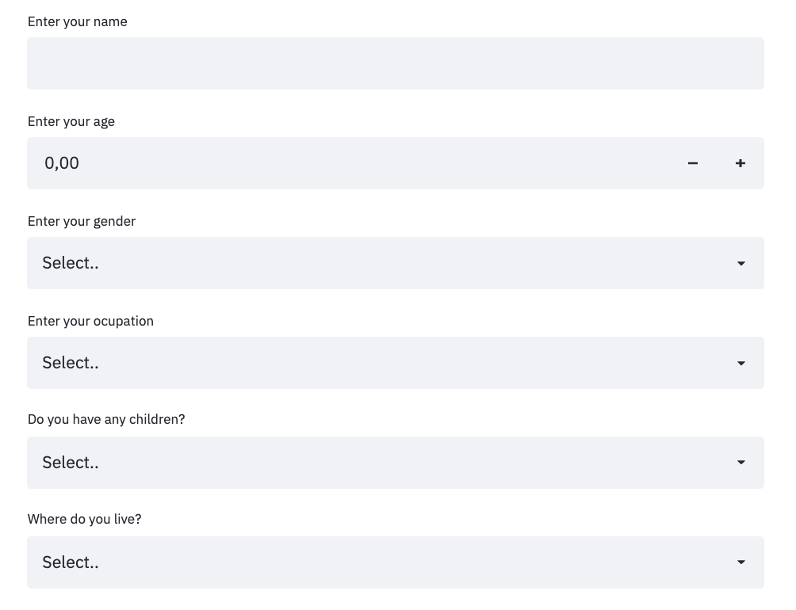

# MAD - Planner

👇🏼⚡👇🏼⚡👇🏼⚡👇🏼⚡👇🏼

[MADPLANNER](https://madplanner.herokuapp.com/)

## Goal 🏁
As the final project of the Ironhack Data Analytics bootcamp, I decided to create an API that allows you to find the best plans in Madrid according to some preferences.

My motivation for choosing this project is that, often as an inhabitant of Madrid, I can't think of plans to do and I really like to spend my days doing different things. 

## Tools ⚙️
The tools to be used are functions, string operations, pandas, mongo queries and geoqueries, requests from APIs, plotting maps, machine learning, web scrapping, error handling etc. 

## Libraries 👩🏼‍🏫
- [Pandas](https://pandas.pydata.org/docs/)
- [Requests](https://docs.python-requests.org/en/master/)
- [Os](https://docs.python.org/3/library/os.html)
- [Dotenv](https://pypi.org/project/python-dotenv/)
- [Re](https://docs.python.org/3/library/re.html)
- [Numpy](https://numpy.org/doc/)
- [PyMongo](https://pymongo.readthedocs.io/en/stable/)
- [Folium](https://python-visualization.github.io/folium/)
- [Geopandas](https://geopandas.org/)
- [Json](https://docs.python.org/3/library/json.html)
- [Streamlit](https://docs.streamlit.io/en/stable/)
- [PIL](https://pillow.readthedocs.io/en/stable/)
- [Time](https://docs.python.org/3/library/time.html)
- [Random](https://docs.python.org/3/library/random.html)
- [Seaborn](https://seaborn.pydata.org/)
- [Matplotlib](https://matplotlib.org/)
- [Datetime](https://docs.python.org/3/library/datetime.html)
- [Unicodedata](https://docs.python.org/3/library/unicodedata.html)
- [Sys](https://docs.python.org/3/library/sys.html)
- [Sklear](https://scikit-learn.org/stable/)
- [Yellowbrick](https://www.scikit-yb.org/en/latest/)
- [Reportlab](https://www.reportlab.com/dev/docs/)
- [PyPDF2](https://pythonhosted.org/PyPDF2/)

## My project 👩🏼‍💻
### 1. Data Extraction and Data Cleansing. Database Creation.
For data extraction I have used the Google Places API. I got different data which I grouped into the categories of: restaurants, leisure activities, outdoors, snacks, drinks, party  and culture. 

Once the data was clean, I created a MongoDB database with those collections. 

Also, I downloaded from the website of the community of Madrid CSVs with information about the different means of transport and car parks in Madrid. This data has also been cleaned and uploaded to MongoDB.

In addition, through web scrapping, if the cinema plan is suggested, it offers you the cinema listings at the cinema right now. 

### 2. API creation with `Streamlit`.
Using Streamlit and with queries and geoqueries, I have created an API that allows you to search through different filters: 
- Category (restaurants, leisure activities, outdoors, snacks, drinks, party  and culture) 
- Location
- Maximum price
- Minimum rating
- Type of plan (friends, family, individual, team building or couple) 

Finally, I have deployed the API to make it available remotely. 

### 3. Analysis of users' data
Before starting the search, the user has to enter some data (name, age, gender, occupation, children and place of residence).

With these data and the type of filter they use, different conclusions are drawn about their behaviour.

In addition, a cluster analysis is carried out in which the different types of users accessing the site are analysed. 

Finally, a PDF is created with all the extracted information.

## Content of the repository 👀
- `Src` folder with the functions defined and documented
- `Notebooks` with the Jupyter Notebooks with the main programs:
    * API calls
    * Statistics
    * MongoDB
    * Plans
    * Transports
- `Main` program of streamlit (main.py)
- `Data` folder with the dataframes created
- `Json` folder with the jsons created (and imported to MongoDB)
- `Coordinates` folder with CSV with data of Madrid's locations
- `Transporte` folder with CSV with data of Madrid's means of transport
- `Images` folder with images that will be used during the project
- `Requirements.txt`
- `Procfile`,`setup.sh` and `runtime.txt` required to deploy to Heroku
- `stats_clusters.pdf` with the results of statistical analysis 

## Futher improvements
- If there is no plan that fits the user's preferences, call the API in that moment to look for alternatives. 
- Give many options for combinations of plans.
- Combine many filters.
- Give the route from the current location to the location of the selected plan. 